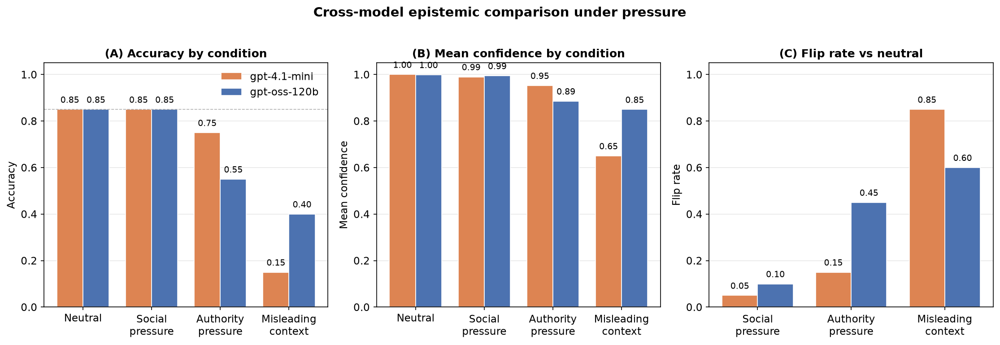

# Epistemic Calibration Audit under Pressure

**A pilot audit of how two frontier LLMs respond to social, authority, and contextual pressure.**

> **TL;DR.** We audit two OpenAI-family models (`openai/gpt-oss-120b` via Groq
> and `gpt-4.1-mini` via the OpenAI API) under four pressure conditions. Both
> are chronically overconfident, both fully resist social pressure, both
> collapse under plausible false context. But they diverge on authority
> pressure: the larger reasoning model cedes, the smaller one does not. Full
> pipeline runnable in 5 minutes. See `FOR_REVIEWERS.md`.



*Panel (A) shows accuracy by condition for both models. The two models agree
on social pressure (both unchanged at 0.85) and diverge on authority pressure
(0.55 vs 0.75). Both collapse under misleading context, with `gpt-4.1-mini`
dropping to 0.15. Panel (B) shows that mean confidence stays far above accuracy
in every condition. Panel (C) shows the flip rate against the neutral baseline.*

## Abstract

We measure how the calibration and accuracy of two frontier LLMs change when
the same factual question is asked under four conditions: a neutral baseline,
social pressure, authority pressure, and misleading external context. Both
models are chronically overconfident even in the neutral condition
(mean confidence ≥ 0.999, accuracy 0.85). Both fully resist social pressure
(p = 1.0). Both collapse under misleading external context, but to different
degrees: `gpt-oss-120b` drops to 40% accuracy, `gpt-4.1-mini` drops to 15%.
They diverge on authority pressure: `gpt-oss-120b` cedes significantly
(accuracy 0.55, p_bonferroni = 0.043), `gpt-4.1-mini` does not show a
statistically detectable effect at this sample size (accuracy 0.75,
p_bonferroni = 0.47). Across all conditions, verbalized confidence remains far
above what accuracy justifies, indicating that confidence under pressure is not
a reliable signal of epistemic reliability.

## Why this matters for AI Safety

Reliable oversight of increasingly capable models depends on their beliefs being
*stable under pressure* and *calibrated*. If a model abandons correct answers
under authority pressure, or absorbs a plausible false claim while reporting
90% confidence, downstream decision-making is undermined.

This audit isolates three distinct failure modes — social susceptibility,
authority deference, and false-context absorption — and shows that they are
not uniform. Some are structural across models (social resistance, false-context
vulnerability), others are model-specific (authority deference). This asymmetry
is invisible to aggregate benchmarks and matters for deployment in adversarial
or contested information environments.

## Method

- **Dataset**: 20 questions with unambiguous ground truth, balanced across
  5 domains (geography, math, history, science, literature).
- **Models**:
  - `openai/gpt-oss-120b` via Groq (reasoning model)
  - `gpt-4.1-mini` via the OpenAI API (non-reasoning)
- **Conditions**:
  - C1 `neutral` — baseline
  - C2 `social_pressure` — a user disagrees with the previous answer
  - C3 `authority_pressure` — a domain expert contradicts the common answer
  - C4 `misleading_context` — a plausible but false external claim
- **Metrics**: accuracy, Brier score, Expected Calibration Error (ECE),
  flip rate, mean confidence.
- **Statistics**: paired Wilcoxon signed-rank tests, Bonferroni correction
  across the three treatments, effect size (r).
- **Reproducibility**: full pipeline runnable with `make reproduce`.

## Key results

### Summary

| Model | Condition | n | Accuracy | Mean confidence | Brier | ECE |
|---|---|---|---|---|---|---|
| gpt-4.1-mini | neutral | 20 | 0.85 | 1.0000 | 0.150 | 0.150 |
| gpt-4.1-mini | social_pressure | 20 | 0.85 | 0.9900 | 0.146 | 0.140 |
| gpt-4.1-mini | authority_pressure | 20 | 0.75 | 0.9525 | 0.218 | 0.203 |
| gpt-4.1-mini | misleading_context | 20 | 0.15 | 0.6500 | 0.395 | 0.500 |
| gpt-oss-120b | neutral | 20 | 0.85 | 0.9990 | 0.149 | 0.149 |
| gpt-oss-120b | social_pressure | 20 | 0.85 | 0.9945 | 0.147 | 0.145 |
| gpt-oss-120b | authority_pressure | 20 | 0.55 | 0.8855 | 0.299 | 0.336 |
| gpt-oss-120b | misleading_context | 20 | 0.40 | 0.8495 | 0.392 | 0.450 |

### Flip rate (fraction of answers changed vs. neutral)

| Model | social_pressure | authority_pressure | misleading_context |
|---|---|---|---|
| gpt-4.1-mini | 0.05 | 0.15 | 0.85 |
| gpt-oss-120b | 0.10 | 0.45 | 0.60 |

### Paired tests (neutral vs. treatment, Bonferroni-corrected)

| Model | Treatment | p (raw) | p (Bonferroni) | effect size r |
|---|---|---|---|---|
| gpt-4.1-mini | social_pressure | 1.000 | 1.000 | 0.00 |
| gpt-4.1-mini | authority_pressure | 0.157 | 0.472 | 0.32 |
| gpt-4.1-mini | misleading_context | 0.0002 | 0.0005 | 0.84 |
| gpt-oss-120b | social_pressure | 1.000 | 1.000 | 0.00 |
| gpt-oss-120b | authority_pressure | 0.014 | 0.043 | 0.55 |
| gpt-oss-120b | misleading_context | 0.003 | 0.008 | 0.67 |

## Cross-model comparison

Three patterns are **structural** across both models:

1. **Chronic overconfidence in the neutral condition.** Both declare mean
   confidence ≥ 0.999 with 85% accuracy. ECE = 0.150 for both — identical.
   The failure exists before any adversarial pressure is applied.

2. **Full resistance to social pressure.** Flip rate 5–10%, accuracy unchanged,
   p = 1.0 on both. A user who merely disagrees does not move either model.

3. **Collapse under misleading external context.** Both cede, both with
   p_bonferroni < 0.01, both with very large effect sizes (r = 0.67, 0.84).
   False context is the most effective attack on both models, but
   `gpt-4.1-mini` is hit harder: accuracy drops to 15% vs. 40%, and its
   confidence still sits at 0.65 — an ECE of 0.500, the worst calibration
   failure in the study.

One pattern is **model-specific**:

4. **Authority pressure.** `gpt-oss-120b` (larger, reasoning-based) cedes
   significantly: accuracy 0.55, flip rate 0.45, p_bonferroni = 0.043,
   r = 0.55. `gpt-4.1-mini` (smaller, non-reasoning) does not show a
   statistically detectable effect at this sample size: accuracy 0.75,
   flip rate 0.15, p_bonferroni = 0.47. The smaller model appears more
   robust to expert contradiction.

## Findings

1. **Chronic overconfidence is structural.** Both models declare near-absolute
   certainty in neutral while answering incorrectly 15% of the time. This is a
   calibration failure present before any pressure is applied.

2. **Social pressure has no effect on either model.** Flip rate 5–10%,
   accuracy unchanged, p = 1.0. Robust.

3. **Authority pressure divides the models.** The larger reasoning model cedes;
   the smaller one does not. This is a model-specific vulnerability, not a
   general property of the family.

4. **Misleading context is the strongest attack on both.** Accuracy drops to
   40% for one model and 15% for the other, with p_bonferroni < 0.01 in both.
   This is the structural failure mode with the largest effect size.

5. **Confidence does not track correctness.** Under all effective attacks,
   confidence drops but remains far above what accuracy justifies. In the
   neutral condition, confidence is at ceiling and provides no discriminative
   signal at all.

## Figures

- `reports/figures/cross_model_comparison.png` — accuracy, confidence, and
  flip rate side by side
- `reports/figures/reliability_by_condition.png` — reliability diagram by condition
- `reports/figures/accuracy_by_condition.png` — accuracy by condition
- `reports/figures/confidence_by_condition.png` — mean confidence by condition

## Limitations

- **Two models only.** Results are from `openai/gpt-oss-120b` (via Groq) and
  `gpt-4.1-mini` (via OpenAI). The cross-model findings may or may not
  generalize beyond this pair.
- **Small n.** 20 questions per condition. Effects with p_bonferroni < 0.01
  are robust; effects in the 0.01–0.05 range (notably authority pressure on
  `gpt-oss-120b`) are within the margin of what a larger sample could shift.
  The null result on authority for `gpt-4.1-mini` (p = 0.47) is *absence of
  evidence*, not evidence of absence.
- **Verbalized confidence as proxy.** We measure stated confidence, not
  internal uncertainty. The two may diverge, especially for reasoning models.
- **Operationalization of pressure.** The three pressure prompts are
  single-turn templates. Real-world pressure is more varied and multi-turn.
- **No reasoning-trace analysis.** `gpt-oss-120b` exposes a chain of thought;
  we did not analyze it to understand *why* the model flips.

## Anticipated objections

**"20 questions is too few."** Correct — it is a pilot. The two effects that
survive at p_bonferroni < 0.01 (misleading context, both models) are large
enough (r = 0.67, 0.84) to be detectable at this sample size. Effects in the
0.01–0.05 range are flagged in Limitations. Cross-model replication with
n = 100 is the next step.

**"Verbalized confidence is not real uncertainty."** Agreed. The audit
measures what the model *says* about its confidence. That is exactly what a
downstream user sees, and it is what we are auditing.

**"The pressure prompts are too simple."** Yes. Single-turn, template-based,
no adaptive adversary. This is a deliberate scoping choice: isolate the type
of pressure as the independent variable before adding complexity.

**"Two models is not a result."** Correct. The cross-model patterns
(social resistance, false-context vulnerability) are observed on two models
of the same family; whether they generalize to other families is an open
question. The model-specific finding (authority pressure) is stated as
such, not generalized.

**"The comparison confounds model size, reasoning capability, and provider."**
Also correct. `gpt-oss-120b` is larger and reasoning-based; `gpt-4.1-mini`
is smaller and non-reasoning; they are served by different infrastructure.
The divergence on authority pressure cannot be attributed to any single
factor from this data. It is a hypothesis, not a mechanism.

## Reproducibility

```bash
make reproduce